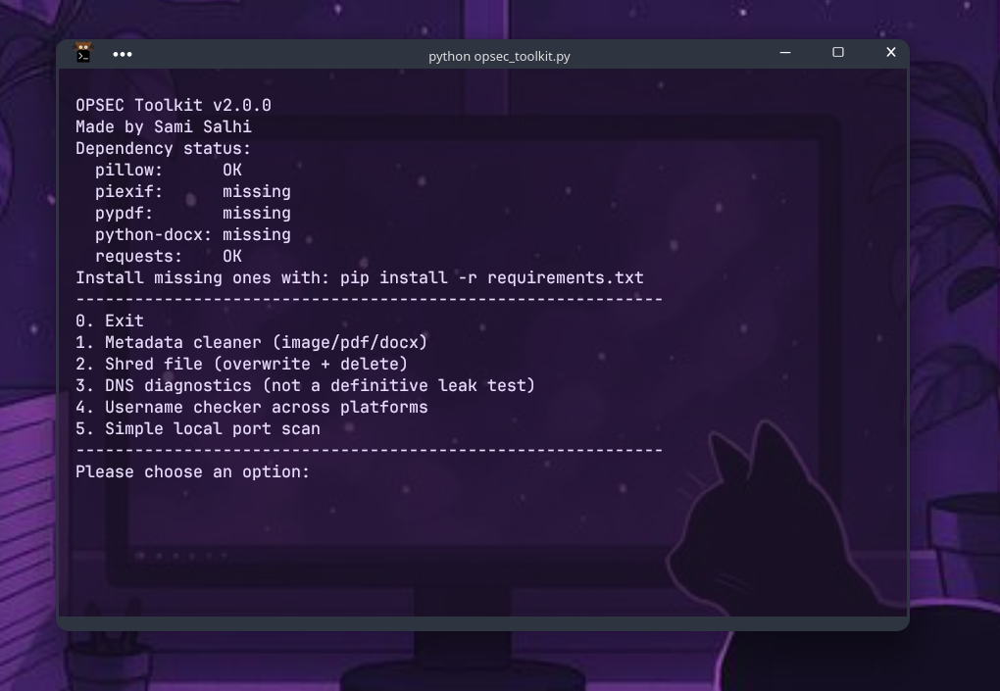

# OPSEC Toolkit

A lightweight command-line toolkit for everyday operational security tasks.

Built to automate small but important privacy habits: removing metadata,
securely deleting sensitive files, checking DNS configuration, scanning
local exposure, and doing quick username checks — all in one script.

## Features

- Remove metadata from images, PDFs, and DOCX files
- File shredder (overwrite + delete)
- DNS diagnostics (see which resolvers your system is actually using)
- Username checker across common platforms (now checked concurrently)
- Local TCP port scanner (now multi-threaded — a 1-1024 range scan takes
  seconds instead of minutes)
- Works offline (except username checks and DNS resolution tests)
- Still a single file — no package/install step beyond the dependencies

## Installation

```bash
git clone https://github.com/itzj0eblack/Simple-Opsec-Toolkit.git
cd opsec-toolkit
pip install -r requirements.txt
```

## Usage

### Interactive menu (original behavior)

```bash
python opsec_toolkit.py
```

### Scriptable CLI

Every feature is also available as a subcommand, so it can be scripted or
dropped into a shell alias:

```bash
# Strip metadata from a file
python opsec_toolkit.py clean photo.jpg

# Shred a file (prompts for confirmation unless -y is passed)
python opsec_toolkit.py shred secret.txt --passes 5
python opsec_toolkit.py shred secret.txt -y          # skip confirmation

# DNS resolver diagnostics
python opsec_toolkit.py dns

# Username footprint check
python opsec_toolkit.py footprint someusername -w 5

# Port scan
python opsec_toolkit.py scan --host 127.0.0.1 --range 1-1024 -w 200 -t 0.3
```

Run `python opsec_toolkit.py --help` or `python opsec_toolkit.py <command> --help`
for the full option list.

## Testing

```bash
pip install pytest
pytest test_opsec_toolkit.py -v
```

Tests cover the pure/deterministic logic (path handling, port-range parsing,
port scanning against a real local socket, shredding on temp files, resolver
dedup). Network-dependent checks (real footprint lookups, real DNS
resolution) are intentionally left to manual testing.

## Overview



## Limitations

- Shredding is not guaranteed on SSDs or copy-on-write filesystems (Btrfs,
  ZFS, APFS) — wear leveling and CoW mean the physical overwrite may not
  land where the original data was.
- DNS check is not a full leak test (no packet capture).
- Username checks may be blocked or rate-limited by the target sites.
- Port scanner is basic TCP connect-scan only (no SYN scan, no service
  fingerprinting).
- DOCX metadata cleaning clears core properties (author, title, etc.) but
  does not strip revision/rsid tracking data embedded in the document XML —
  re-save via "Save As" in Word/LibreOffice for that.
